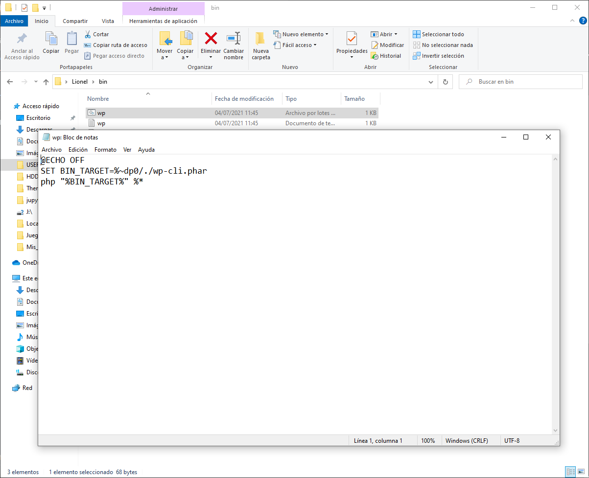
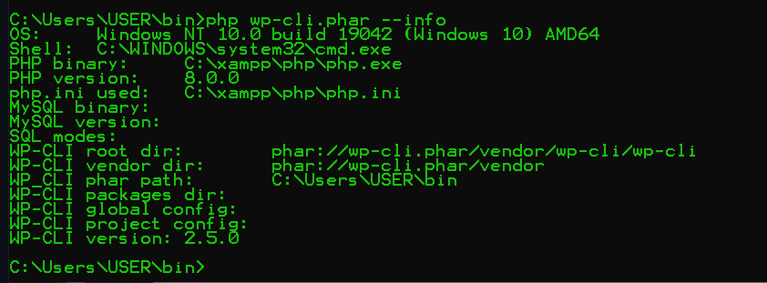
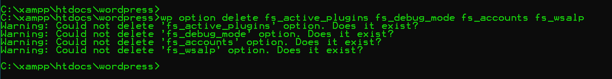
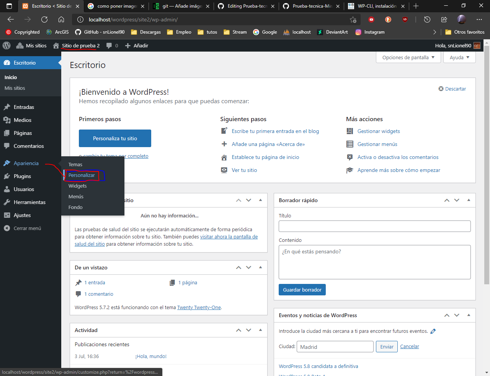
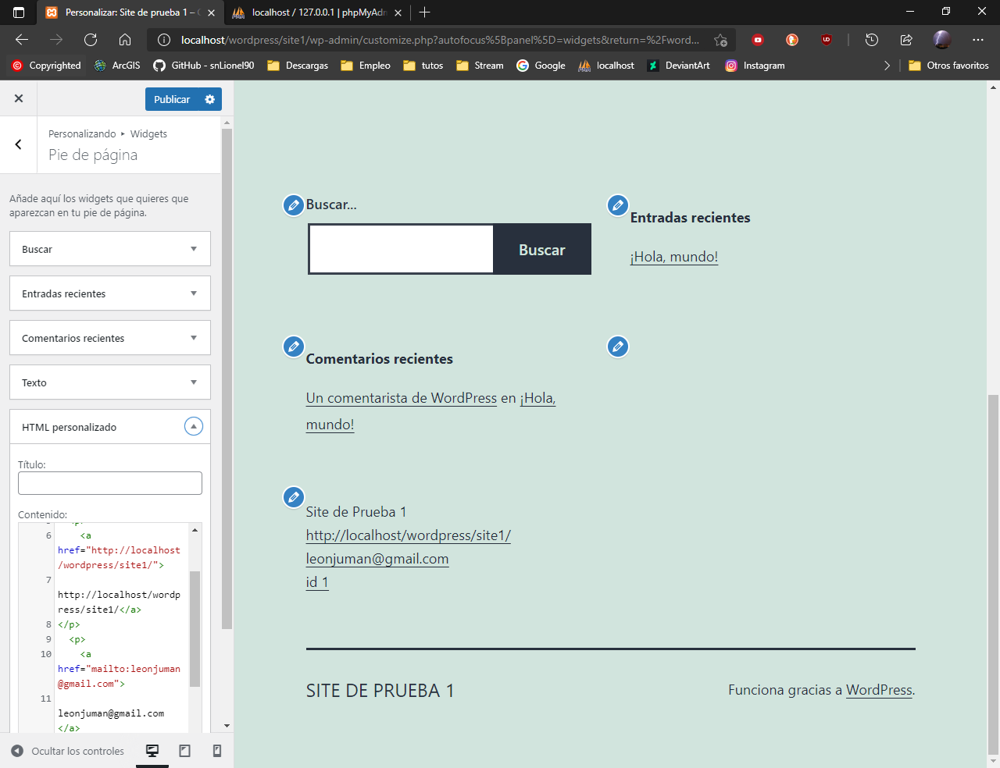
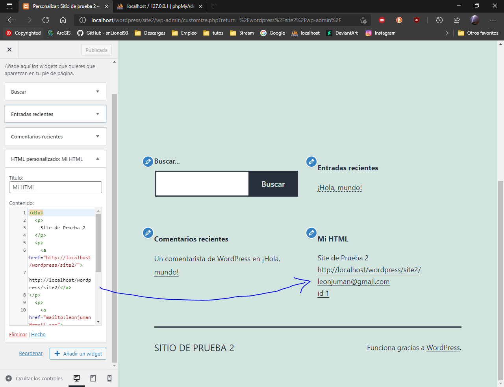

# Prueba-tecnica-Mirai
-----------------------
<h1>Tutorial de administracion de Worpress.</h1>

Parala activacion de multisite ,ver capturas en:

 https://github.com/snLionel90/Prueba-tecnica-Mirai/tree/main/multisite
   
<h2>Prueba 1</h2>
<h3>La instalación de WP-CLI es sencilla. En principio tienes que descargar un archivo PHP y ponerlo en algún lugar de tu servidor para poder ejecutarlo desde donde te encuentres. Puedes descargar WP-CLI desde su repositorio en GitHub, tecleando lo siguiente:</h3>
<ul>
  <li>curl -O https://raw.githubusercontent.com/wp-cli/builds/gh-pages/phar/wp-cli.phar</li> 
 </ul>

 una vez instalado, comprobamos que es valido el fichero obtenido con:

<li>php wp-cli.phar --info </li>

y lo copiamos a nuestra carpeta de usuario (nombre_usuario)

<li>C:\Users\tu_usuario\bin (si no existe, créala).</li>

A continuación, en la misma carpeta crea un archivo wp.bat y escribe estas líneas dentro:

<li>@ECHO OFF
SET BIN_TARGET=%~dp0/./wp-cli.phar
php "%BIN_TARGET%" %*</li>

Ya casi estamos, vuelve a las variables de entorno a través del Panel de Control como hemos hecho antes, pero esta vez ve a Variables de Usuario. Edita PATH y añade «C:\Users\tu_usuario\bin».

Reinicia la consola y simplemente escribe wp --info. Si has hecho todo bien debe aparecerte la misma información que antes cuando ejecutamos 

<li>php wp-cli.phar --info</li>

 

 Una vez realizados todos los preparativos, ejecutamos el comando WP-ClI para eliminar las options, el comando es:

  <li>wp option delete fs_active_plugins fs_debug_mode fs_accounts fs_wsalp</li>
 
   
  
 como la instalacion es de serie dichas opctiones no estan incluidas, pero en el caso de tenerlas, dejarian de estar disponibles

   
  <h2>Prueba 2</h2>
  <h3>La modificacion de los temas es muy sencillo, para ello, tendras que entrar en el site, recuerda desde administracion (http://localhost/wordpress/site2/wp-admin/), en mi caso por ejemplo site2, e ir a:</h3>
  <li>escritorio -> apariencia -> personalizar<li>
   
  
 una vez, dentro, saldra un panel lateral, bian, seleccionamos HTML personalizado y escribimos los siguientes datos:

  <li>URL del Site</li>
  <li>Nombre del site</li>
  <li>Direccion de Email</li>
  <li>y el id del post o pagina situada</li>
  
 quedando de esta forma en ambos sites

  
  
   

 en cuanto al desarrollo del plugin no he podido realizarlo ya que mi pc me estaba dando problemas con php continuamente, adjunto el codigo

 
  
